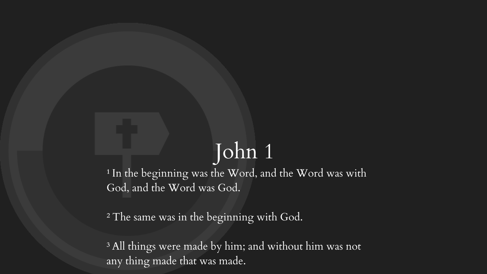
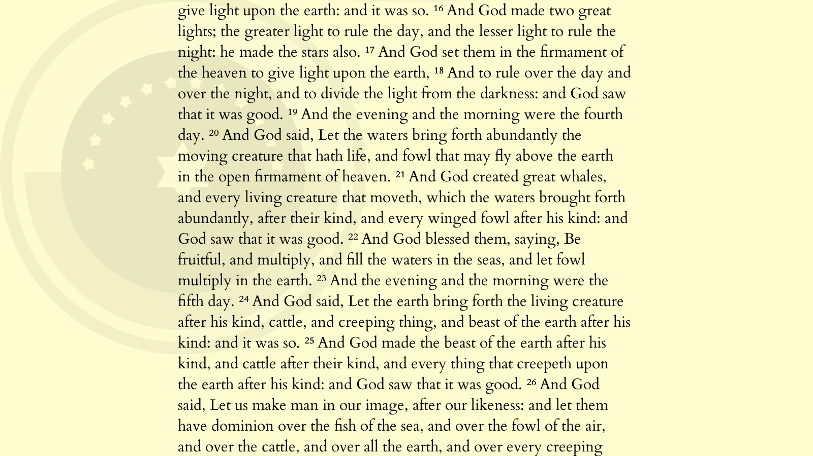

# Bible
A (kinda) fast Bible that anyone can use.

## Usage

``Arrows left/right`` - Change chapter

``Ctrl + F`` - Verse lookup (kinda buggy)

``Ctrl + L`` - Toggle verse-per-line reading

``Scroll wheel/Up arrow/Down arrow`` - Scroll (hold ``Ctrl`` while you scroll to enlargen)

``Ctrl + D`` - Toggle dark mode

``=/-`` - Increase/Decrease wrap width

### Versions

Currently, the program comes with these versions:

* BSB (Berean Standard Bible)
* BBE (Bible In Basic English)
* KJV (King James Version / Authorized Version)
* AKJV (American KJV)
* UKJV (Updated KJV)
* WEB (World English Bible)

(find them [here](books/); they are can be used out of the box)

To change Bible versions, drag a compatible file (with the format below) from the file explorer.

***
Files with this format:

```xml
<bible lang="<any language in Books.json>">
    <b> <!-- book -->
        <c n="<chapterNumber>"> <!-- chapter -->
            <v n="<verseNumber>"> <!-- verse -->
            </v>
        </c>
    </b>
</bible>
```

will be accepted (See [KJV.xml](books/KJV.xml) as an example).

***

### [text2xml.py](text2xml.py)

This file turns any text file arranged in a certain way to an XML file parsable by this program.

You use to program as such:

```
python text2xml.py <inputTextFile> <outputXMLFile> <(optional; defaults to "en") language in Books.json>
```

and the file must be arranged as such:

```
Genesis\t1\t1\tIn the beginning God created the heavens and the earth.\n
```

*Note*: all `\t` should be replaced with actual tabs, and `\n` should be replaced with a newline.

You can find an example [here](books/bsb.txt).

## Images




More stuff coming soon!

## Thanks

Thanks to [OverviewBible](https://overviewbible.com/) for the **BEAUTIFUL** icons!
