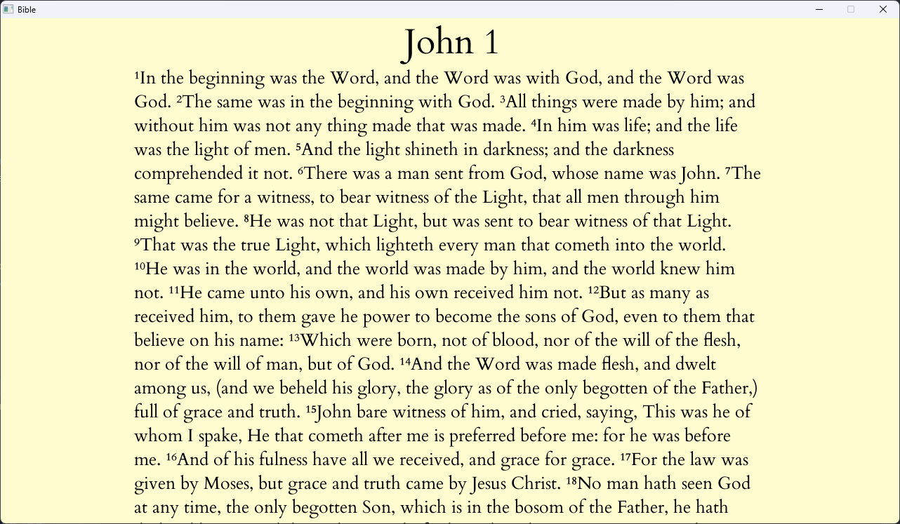
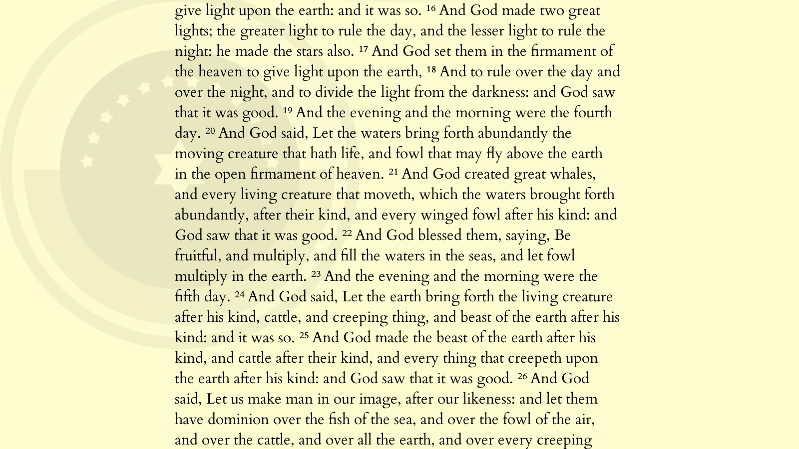

# Bible
A (kinda) fast Bible that anyone can use.

## Usage

``Arrows left/right`` - Change chapter

``Ctrl + F`` - Change Bible book and/or chapter (kinda buggy)

``Ctrl + L`` - Toggle verse-per-line reading

``Scroll wheel/Up arrow/Down arrow`` - Scroll (hold ``Ctrl`` while you scroll to enlargen)

``Ctrl + D`` - Toggle dark mode

To change Bible versions, type `./bible -v <version>`.

Currently, you can select from these versions:

* BBE
* KJV
* WEB

***

In the future, any file with the format:

```xml
<bible lang="<language in Books.json>">
    <b> <!-- book -->
        <c> <!-- chapter -->
            <v> <!-- verse -->
            </v>
        </c>
    </b>
</bible>
```

will be accepted (See [KJV.xml](books/KJV.xml) as an example).

***

## Images





More stuff coming soon!

## Thanks

Thanks to [OverviewBible](https://overviewbible.com/) for the **BEAUTIFUL** icons!
